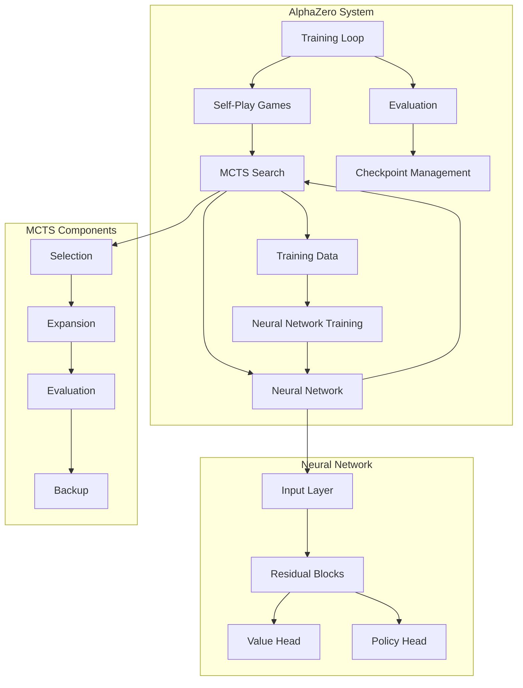
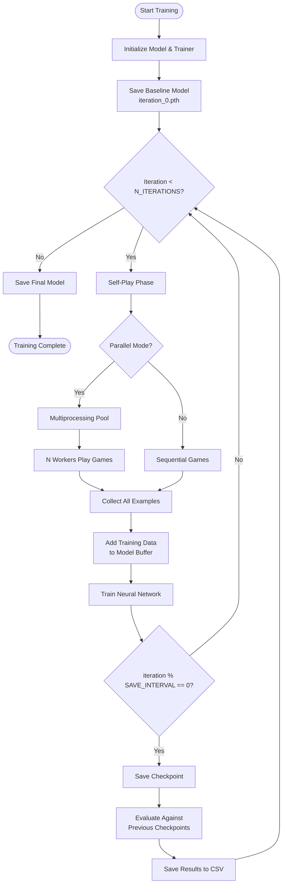
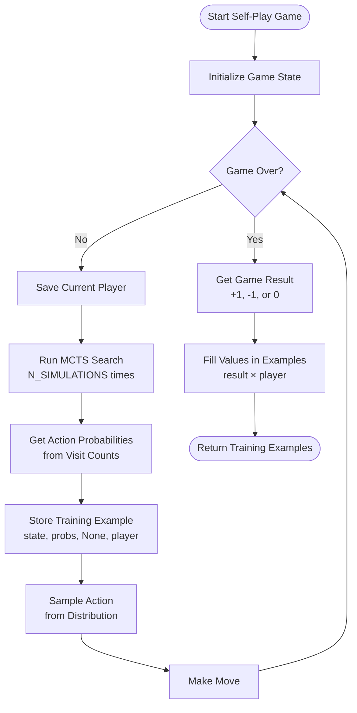
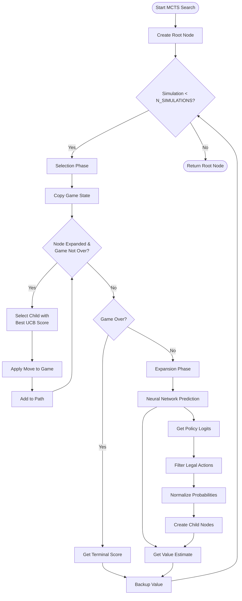
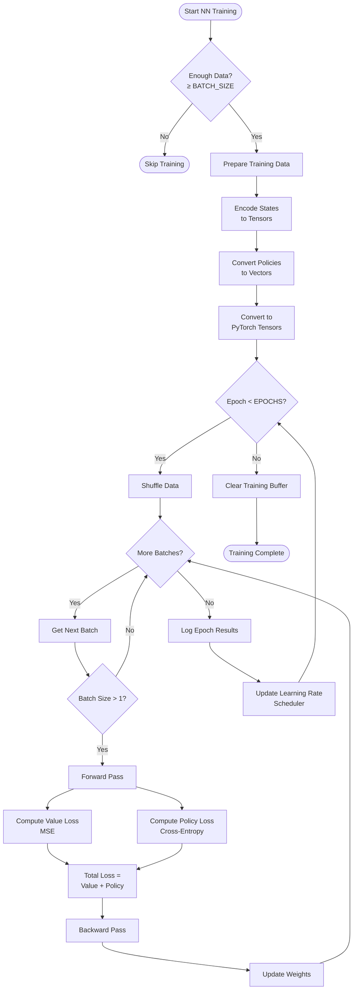
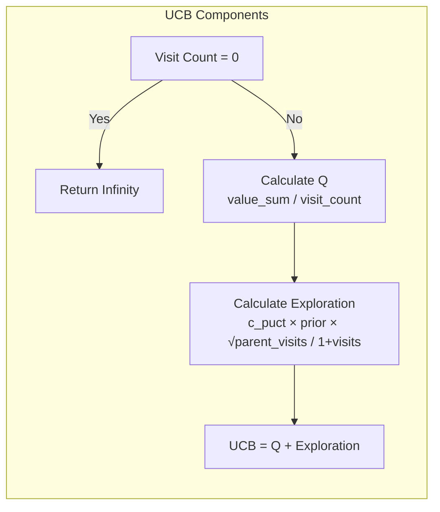
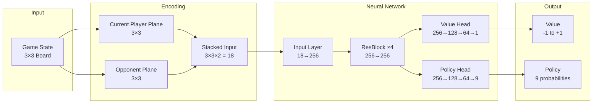

# AlphaZero Tic-Tac-Toe: Technical Documentation

## Table of Contents
1. [Overview](#overview)
2. [System Architecture](#system-architecture)
3. [Core Components](#core-components)
4. [Training Pipeline](#training-pipeline)
5. [Detailed Flowcharts](#detailed-flowcharts)
6. [Hyperparameters](#hyperparameters)
7. [API Reference](#api-reference)

---

## Overview

This project implements a simplified version of DeepMind's AlphaZero algorithm for playing Tic-Tac-Toe. The system combines:
- **Monte Carlo Tree Search (MCTS)** for strategic planning
- **Deep Neural Networks** (ResNet architecture) for position evaluation and move prediction
- **Self-play reinforcement learning** for training without human data

### Key Features
- PyTorch-based deep neural network with residual blocks
- Multi-process parallel self-play for efficient training
- Comprehensive evaluation system with historical checkpoints
- Configurable hyperparameters for experimentation

---

## System Architecture



---

## Core Components

### 1. MCTSNode
Represents a node in the Monte Carlo Tree Search.

**Attributes:**
- `state`: Current game state
- `parent`: Parent node reference
- `action`: Action that led to this state
- `children`: Dictionary of child nodes
- `visit_count`: Number of times visited
- `value_sum`: Cumulative value
- `prior`: Prior probability from neural network

**Key Methods:**
- `ucb_score()`: Calculates Upper Confidence Bound for tree policy
- `select_child()`: Selects best child using UCB formula
- `expand()`: Creates child nodes for all legal actions
- `backup()`: Propagates value up the tree

### 2. AlphaZeroMCTS
Manages the Monte Carlo Tree Search process.

**Parameters:**
- `game`: Game environment instance
- `model`: Neural network model
- `c_puct`: Exploration constant (default: 1.0)
- `num_simulations`: Number of MCTS simulations (default: 100)

**Key Methods:**
- `search()`: Performs MCTS simulations from root state
- `get_action_probabilities()`: Returns visit-count-based action distribution

### 3. AlphaZeroNet
ResNet-based neural network with dual heads.

**Architecture:**
```
Input (3x3x2) → Projection Layer → Residual Blocks × 4 → 
    ├─ Value Head → tanh(-1 to 1)
    └─ Policy Head → softmax(9 actions)
```

**Components:**
- **Input Layer**: Linear projection from 18 features to hidden dimension
- **Residual Blocks**: 4 blocks with batch normalization and dropout
- **Value Head**: 3-layer MLP outputting game outcome prediction
- **Policy Head**: 3-layer MLP outputting action probabilities

### 4. AlphaZeroModel
High-level model wrapper for training and inference.

**Features:**
- State encoding (board → tensor)
- Training data management
- Loss computation (value MSE + policy cross-entropy)
- Model persistence (save/load)
- Learning rate scheduling

### 5. AlphaZeroTrainer
Orchestrates the training process.

**Capabilities:**
- Self-play game generation (sequential or parallel)
- Training iteration management
- Model evaluation against checkpoints
- Results tracking and CSV export

---

## Training Pipeline

### Complete Training Flow



### Self-Play Game Flow



### MCTS Search Process



### Neural Network Training



### UCB Score Calculation

The Upper Confidence Bound (UCB) formula balances exploitation and exploration:

```
UCB(node) = Q(node) + c_puct × P(node) × √(N(parent)) / (1 + N(node))
```

Where:
- **Q(node)**: Average value of the node (exploitation)
- **P(node)**: Prior probability from neural network
- **N(parent)**: Visit count of parent node
- **N(node)**: Visit count of current node
- **c_puct**: Exploration constant (typically 1.0)



---

## Hyperparameters

### Training Configuration

| Parameter | Value | Description |
|-----------|-------|-------------|
| `N_ITERATIONS` | 500 | Total training iterations |
| `N_GAMES` | 200 | Self-play games per iteration |
| `N_SIMULATIONS` | 100 | MCTS simulations per move |
| `C_PUCT` | 1.0 | UCB exploration constant |
| `TEMPERATURE` | 1.0 | Action selection randomness |

### Neural Network

| Parameter | Value | Description |
|-----------|-------|-------------|
| `HIDDEN_SIZE` | 256 | Hidden layer dimension |
| `NUM_RES_BLOCKS` | 4 | Number of residual blocks |
| `DROPOUT` | 0.2 | Dropout probability |
| `LEARNING_RATE` | 0.001 | Initial learning rate |
| `WEIGHT_DECAY` | 1e-4 | L2 regularization |
| `BATCH_SIZE` | 64 | Training batch size |
| `EPOCHS` | 10 | Epochs per iteration |

### Optimization

| Parameter | Value | Description |
|-----------|-------|-------------|
| `LR_STEP_SIZE` | 100 | LR scheduler step size |
| `LR_GAMMA` | 0.9 | LR decay factor |
| `SAVE_INTERVAL` | 25 | Checkpoint save interval |
| `EVAL_INTERVAL` | 25 | Evaluation interval |
| `EVAL_GAMES` | 50 | Games for evaluation |

---

## API Reference

### TicTacToeGame Interface

```python
class TicTacToeGame:
    def __init__(self):
        """Initialize empty 3x3 board"""
        
    def copy(self) -> TicTacToeGame:
        """Create deep copy of game state"""
        
    def state(self) -> tuple:
        """Return immutable state representation"""
        
    def valid_moves(self) -> list[int]:
        """Return list of legal move indices (0-8)"""
        
    def make_move(self, action: int) -> bool:
        """Apply move and switch players"""
        
    def over(self) -> bool:
        """Check if game is terminal"""
        
    def score(self) -> int:
        """Return +1 (player 1 win), -1 (player -1 win), 0 (draw)"""
```

### Model Usage

```python
# Initialize model
model = AlphaZeroModel(
    board_size=3,
    action_size=9,
    learning_rate=0.001
)

# Get predictions
game = TicTacToeGame()
value, policy = model.predict(game)

# Add training data
model.add_training_data(game.state(), action_probs_dict, value)

# Train on collected data
model.train(batch_size=64, epochs=10)

# Save/load
model.save_model("checkpoint.pth")
loaded_model = AlphaZeroModel.load_from_file("checkpoint.pth")
```

### Training Example

```python
# Create trainer
trainer = AlphaZeroTrainer(
    game_class=TicTacToeGame,
    model=model,
    mcts_simulations=100
)

# Run single iteration
trainer.train_iteration(num_games=500, num_workers=4)

# Evaluate against baseline
wins, draws, losses = trainer.evaluate_model(
    opponent_model=baseline_model,
    num_games=50
)
```

---

## Data Flow Diagram



---

## State Encoding

The game state is encoded into two binary planes:

1. **Current Player Plane**: `1` where current player has pieces, `0` elsewhere
2. **Opponent Plane**: `1` where opponent has pieces, `0` elsewhere

Example:
```
Board:        Current (X):  Opponent (O):
X | O | -     1 | 0 | 0     0 | 1 | 0
---------     ---------     ---------
- | X | -  →  0 | 1 | 0  +  0 | 0 | 0
---------     ---------     ---------
O | - | -     0 | 0 | 0     1 | 0 | 0

Flattened: [1,0,0,0,1,0,0,0,0, 0,1,0,0,0,0,1,0,0] (18 features)
```

---

## File Structure

```
alpha-toe/
├── main.py                      # Core implementation
├── play.py                      # Interactive play script
├── diagnose.py                  # Debugging utilities
├── test_parallel.py             # Parallel processing tests
├── test_high_sims.py           # High simulation tests
├── TECHNICAL_DOCUMENTATION.md   # This file
├── TRAINING_CHANGES.md          # Training modifications log
├── README.md                    # Project overview
├── pyproject.toml              # Dependencies
└── models/
    ├── alphazero_iter_0.pth    # Baseline checkpoint
    ├── alphazero_iter_50.pth   # Checkpoint at iteration 50
    └── evaluation_results.csv  # Evaluation metrics
```

---

## Performance Considerations

### Parallelization
- Self-play games run in parallel using `multiprocessing.Pool`
- Auto-detects CPU cores (uses `cpu_count - 1`)
- Worker processes receive serialized model state
- Can be disabled by setting `num_workers=1`

### Memory Management
- Training buffer cleared after each training iteration
- Batch normalization requires batch size > 1
- Terminal output truncated to prevent memory overflow

### Computational Complexity
- **MCTS per move**: O(N_SIMULATIONS × tree_depth)
- **Neural network forward pass**: O(hidden_size²)
- **Training**: O(EPOCHS × dataset_size / BATCH_SIZE)

---

## Common Workflows

### Training from Scratch
```bash
python main.py
```

### Resume Training
```python
model = AlphaZeroModel.load_from_file("models/alphazero_iter_50.pth")
trainer = AlphaZeroTrainer(TicTacToeGame, model)
# Continue training...
```

### Play Against Model
```python
from play import play_against_ai
play_against_ai("models/alphazero_iter_50.pth")
```

### Analyze Evaluation Results
```python
import pandas as pd
df = pd.read_csv("models/evaluation_results.csv")
print(df.groupby('current_iter')['win_rate'].mean())
```

---

## Future Improvements

1. **Advanced Features**
   - Dirichlet noise for root exploration
   - Temperature annealing schedule
   - Prioritized experience replay
   - Model ensemble voting

2. **Optimizations**
   - GPU acceleration for batch predictions
   - Cached neural network evaluations
   - Asynchronous self-play
   - Distributed training

3. **Extensions**
   - Larger board games (Connect Four, Gomoku)
   - Imperfect information games
   - Transfer learning experiments
   - Opening book generation

---

## References

- Silver, D., et al. (2017). "Mastering Chess and Shogi by Self-Play with a General Reinforcement Learning Algorithm." arXiv:1712.01815
- Silver, D., et al. (2016). "Mastering the game of Go with deep neural networks and tree search." Nature 529, 484-489
- Browne, C., et al. (2012). "A Survey of Monte Carlo Tree Search Methods." IEEE Transactions on Computational Intelligence and AI in Games

---

**Last Updated**: October 28, 2025  
**Version**: 1.0  
**Author**: AlphaZero Tic-Tac-Toe Project
